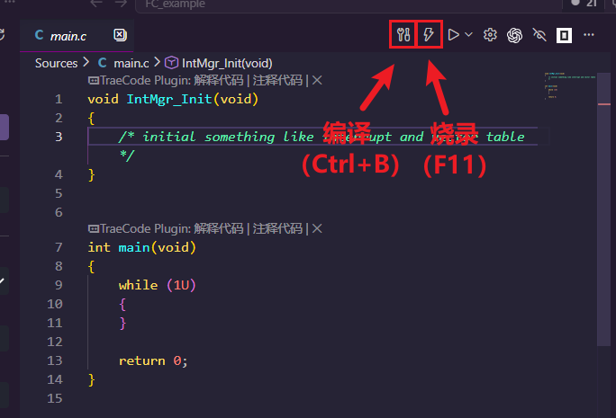

# Eclipse CDT

调用 Eclipse 构建和烧录工程。插件读取 `.project`、`.cproject` 和 Eclipse 目录的 `.launch`，可以和 Eclipse 同时打开工程，不会修改厂商工程文件。界面语言支持中文和英文。

原理是调用厂商 Eclipse 的命令行功能实现。

目前已适配 `Flagchip` 和 `GD32` 的定制版 Eclipse 开发环境。

## 使用方法

