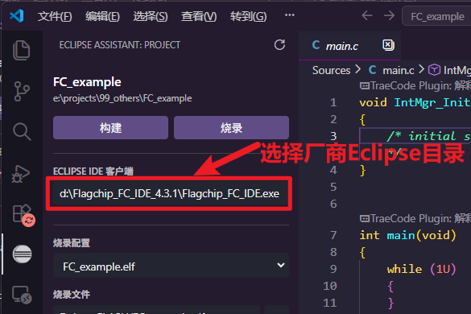
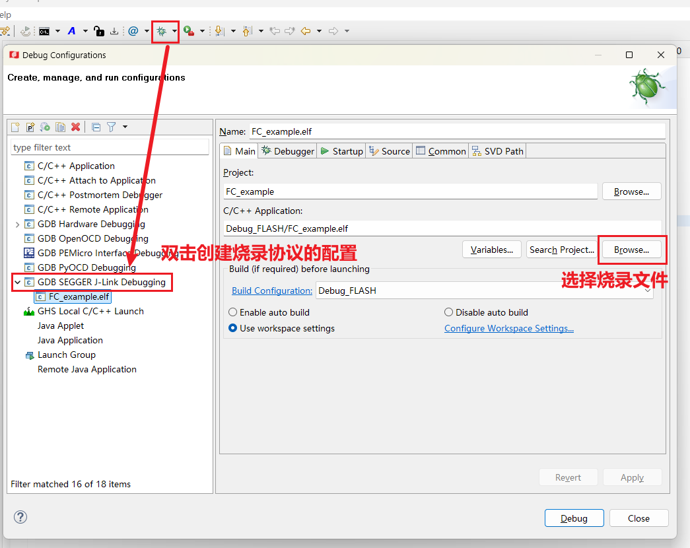

# Eclipse Assistant

调用 Eclipse 构建和烧录工程。插件读取 `.project`、`.cproject` 和 Eclipse 目录的 `.launch`，可以和 Eclipse 同时打开工程，不会修改厂商工程文件。界面语言支持中文和英文。

原理是调用厂商 Eclipse 的命令行功能实现。

目前已适配 `Flagchip` 和 `GD32` 的定制版 Eclipse 开发环境。

构建失败时会在 VS Code 扩展存储目录中自动保存日志。可在设置中调整每个工程保留的失败日志数量，范围为 `0–5`，默认保留最新 `5` 条；成功或主动停止的构建不会保留日志。

## 使用方法

## 编译准备

`Run` → `Debug Configurations...` → 选择一个配置，双击创建 → 选择烧录文件。

